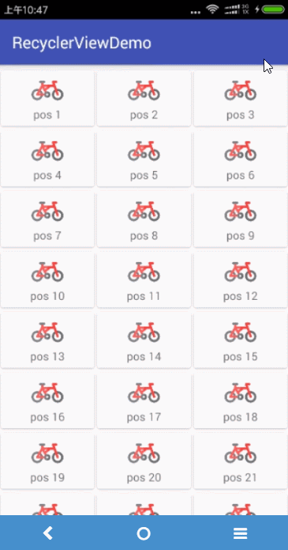

# RecyclerViewDemo
简单的 defaultItemAnimator 效果以及启用 拖拽-滑动删除 效果

使用语言: `Kotlin`

## defaultItemAnimator 
```Kotlin
//设置recyclerview的动画
recyclerView.itemAnimator = DefaultItemAnimator()
//添加或删除数据源后,要调用如下方法才有动画效果
recyclerView.adapter.notifyItemRangeInserted(addPos, addItemCount)
recyclerView.adapter.notifyItemRemoved(removePos)
```


## ItemTouchHelper
拖拽改变item位置以及滑动删除功能我们使用系统提供的 `ItemTouchHelper` 即可
```Kotlin
// 添加滑动/拖拽功能
// java的匿名内部类对应过来就是object对象表达式了
ItemTouchHelper(object : ItemTouchHelper.Callback() {
    var vh: RecyclerView.ViewHolder? = null

    /**
     * 设置itemView可以移动的方向
     * */
    override fun getMovementFlags(recyclerView: RecyclerView?, viewHolder: RecyclerView.ViewHolder?): Int {
        // 拖拽的标记，这里允许上下左右四个方向
        val dragFlags = ItemTouchHelper.UP or ItemTouchHelper.DOWN or ItemTouchHelper.LEFT or
                ItemTouchHelper.RIGHT
        // 滑动的标记，这里允许左右滑动
        val swipeFlags = ItemTouchHelper.START or ItemTouchHelper.END
        return makeMovementFlags(dragFlags, swipeFlags)
    }

    /**
     * 当一个Item被另外的Item替代时回调,也就是数据集的内容顺序改变
     * 返回true, onMoved()才会进行
     * */
    override fun onMove(recyclerView: RecyclerView?, viewHolder: RecyclerView.ViewHolder?, target: RecyclerView.ViewHolder?): Boolean {
        return true
    }

    /**
     *  当onMove返回true的时候回调,刷新列表
     * */
    override fun onMoved(recyclerView: RecyclerView?, viewHolder: RecyclerView.ViewHolder?, fromPos: Int, target: RecyclerView.ViewHolder?, toPos: Int, x: Int, y: Int) {
        super.onMoved(recyclerView, viewHolder, fromPos, target, toPos, x, y)
        // 移动完成后修改列表位置并刷新列表
        Collections.swap(data, viewHolder!!.adapterPosition, target!!.adapterPosition)
        recyclerView.adapter.notifyItemMoved(viewHolder!!.adapterPosition, target!!.adapterPosition)
    }

    /**
     * 滑动完成时回调,这里设置为滑动删除,删除相应数据后刷新列表
     * */
    override fun onSwiped(viewHolder: RecyclerView.ViewHolder?, direction: Int) {
        data.removeAt(viewHolder!!.adapterPosition)
        recyclerView.adapter.notifyItemRemoved(viewHolder!!.adapterPosition)
        toast("删除成功")
    }

    /**
     * Item是否可以滑动
     * */
    override fun isItemViewSwipeEnabled() = true

    /**
     * Item是否可以长按
     * */
    override fun isLongPressDragEnabled() = true

}).attachToRecyclerView(recyclerView)
```



>遗留问题: 在Gird布局中,向右swipe item的时候,中间item的z高度貌似比右侧item的z高度小,导致它是从其右侧的item下方滑出界面的,这个我还没处理掉